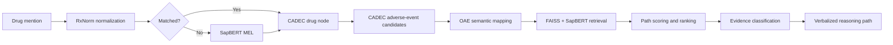

# Drug–Adverse Event Reasoner

**Interpretable biomedical reasoning across CADEC, RxNorm, OAE, SapBERT, FAISS, and knowledge-graph paths.**

`drug_ae_reasoner` is a research-oriented Python package for connecting a **drug mention** and one or more **adverse-event terms** through explicit, inspectable evidence paths.

Rather than relying on a single embedding similarity score, the system combines terminology normalization, biomedical entity linking, graph structure, ontology semantics, and path verbalization to produce traceable reasoning artifacts.

> Research implementation accompanying my work on knowledge-graph-assisted drug–adverse event reasoning, accepted at **IEEE ICDH 2026**.

---

## Why this project exists

Drug–adverse event reasoning is difficult because the same clinical concept can appear under brand names, generic names, informal patient language, ontology labels, or semantically related expressions.

This project explores a multi-source solution:

1. normalize the drug mention with **RxNorm**;
2. fall back to **SapBERT**-based medical entity linking when needed;
3. retrieve candidate adverse-event evidence from **CADEC**;
4. map adverse-event concepts into the **OAE ontology**;
5. use **FAISS + SapBERT** for semantic matching;
6. trace and rank evidence paths from the drug to the user-provided AE term;
7. verbalize the path so the reasoning remains inspectable.

---

## System architecture



### Knowledge sources

| Source | Role |
| --- | --- |
| **CADEC** | Patient-reported drug and adverse-event evidence |
| **RxNorm** | Drug normalization and concept identifiers |
| **OAE** | Biomedical adverse-event ontology and graph structure |
| **SapBERT** | Biomedical semantic representation and fallback entity linking |
| **FAISS** | Efficient nearest-neighbour retrieval over ontology concepts |

---

## Research capabilities

### Multi-stage medical entity linking

The drug mention is resolved through a hierarchy of increasingly semantic strategies:

- RxNorm exact / synonym normalization
- label-level matching
- SapBERT embedding retrieval when lexical matching is insufficient

This makes the system more robust to brand names, aliases, spelling variation, and informal mentions.

### Evidence-path reasoning

For a drug and input AE, the system traces paths of the form:

```text
drug
  → CADEC adverse-event concept
  → OAE concept / ontology path
  → input adverse-event term
```

Candidates are scored using semantic similarity and graph evidence, then converted into readable path descriptions.

### Three-way evidence classification

The research pipeline can emit three categories of paths:

- **positive** — stronger supporting evidence
- **negative** — weaker or contradictory evidence
- **random/control** — baseline paths for comparative evaluation

This is useful for systematic evaluation of whether a model can distinguish meaningful biomedical reasoning paths from weaker or irrelevant ones.

---

## Repository structure

```text
.
├── drug_ae_reasoner/       # package source
│   ├── data/               # data builders and processed resources
│   ├── utils/              # reasoning and path utilities
│   ├── config.py           # centralized resource configuration
│   └── main.py             # CLI entry point
├── tests/                  # tests
├── SUPPLEMENTARY_MATERIAL.md
├── requirements.txt
└── setup.py
```

See [`SUPPLEMENTARY_MATERIAL.md`](./SUPPLEMENTARY_MATERIAL.md) for additional architecture and research details.

---

## Installation

```bash
git clone https://github.com/showman-sharma/drug_ae_reasoner.git
cd drug_ae_reasoner

python -m venv .venv
source .venv/bin/activate      # Windows: .venv\Scripts\activate
pip install -e .
```

---

## Required datasets

The underlying datasets are **not redistributed in this repository**. Download them from their original sources and place them in the expected directories.

| Dataset | Required file | Destination |
| --- | --- | --- |
| CADEC | `train.conll` | `drug_ae_reasoner/data/cadec/` |
| RxNorm | `RXNCONSO.RRF` | `drug_ae_reasoner/data/rxnorm/` |
| OAE | `oae_merged.owl` | `drug_ae_reasoner/data/oae/` |

Sources:

- [CADEC data](https://github.com/gabrielStanovsky/CADEC-for-NLP/tree/master/data)
- [RxNorm](https://www.nlm.nih.gov/research/umls/rxnorm/docs/rxnormfiles.html)
- [Ontology of Adverse Events](https://github.com/OAE-ontology/OAE)

Expected layout:

```text
drug_ae_reasoner/
└── data/
    ├── cadec/train.conll
    ├── rxnorm/RXNCONSO.RRF
    └── oae/oae_merged.owl
```

Build the derived resources with:

```bash
python -m drug_ae_reasoner.data.builder.run_all
```

The builder creates the normalized CADEC graph, OAE graph, SapBERT/FAISS index, and associated label maps used during reasoning.

---

## CLI example

```bash
python -m drug_ae_reasoner.main \
    --drug lipitor \
    --aes pain joints \
    --mel_top_k 5 \
    --mel_threshold 0.5 \
    --n_paths 3 \
    --n_cadec 3 \
    --n_input 3 \
    --cadec_ae_thresh 0.7 \
    --input_ae_thresh 0.7 \
    --n_disconnect 2
```

The pipeline will:

1. resolve the drug mention;
2. identify candidate CADEC adverse events;
3. map candidates into OAE;
4. compare them with the requested AE terms;
5. rank candidate evidence paths;
6. print human-readable reasoning traces.

---

## Python API

```python
from drug_ae_reasoner.utils.path_reasoner import find_top_drug_to_input_ae_paths
from drug_ae_reasoner.config import (
    RX_PATH,
    CADEC_KG_PATH,
    OAE_INDEX_PATH,
    OAE_LABEL_MAP_PATH,
    OAE_GRAPH_PATH,
)

connected, top_paths, fb_drug, fb_ae, verbalized = (
    find_top_drug_to_input_ae_paths(
        drug="lipitor",
        ae_input_list=["pain", "joints"],
        rx_path=RX_PATH,
        cadec_kg_path=CADEC_KG_PATH,
        oae_index_path=OAE_INDEX_PATH,
        oae_label_map_path=OAE_LABEL_MAP_PATH,
        oae_graph_path=OAE_GRAPH_PATH,
        n_paths=5,
        mel_top_k=5,
        mel_threshold=0.5,
        use_embedding=True,
    )
)

print("\n".join(verbalized))
```

---

## Example structured output

```json
{
  "drug": "lipitor",
  "adr": "muscle pain",
  "paths": [
    {
      "mapped_drug_concept": "lipitor",
      "mapped_ae_concept": "muscle problems",
      "path_type": "positive",
      "path_weight": 0.87,
      "relation": "ADR",
      "verbalization": "lipitor → muscle problems (OAE) ~ 'muscle pain'"
    }
  ]
}
```

The important design goal is not merely to return a label, but to retain the **evidence structure that produced it**.

---

## Scope and limitations

This repository is a **research system**, not a clinical decision-support product.

- Results depend on the coverage and quality of CADEC, RxNorm, and OAE.
- Semantic similarity is not equivalent to clinical causality.
- Thresholds and path-scoring choices are experimental design parameters.
- Biomedical outputs must not be interpreted as medical advice or validated pharmacovigilance conclusions.

---

## Attribution

This project builds on publicly available biomedical resources and models, including:

- CADEC corpus
- RxNorm, U.S. National Library of Medicine
- Ontology of Adverse Events (OAE)
- SapBERT
- FAISS

Please respect the licensing and distribution terms of each upstream dataset and resource.

---

## Author

**V. S. S. Anirudh Sharma**  
AI/ML Engineer · Applied AI Researcher

[GitHub](https://github.com/showman-sharma) · [LinkedIn](https://www.linkedin.com/in/v-s-s-anirudh-sharma-ab405617b/)
