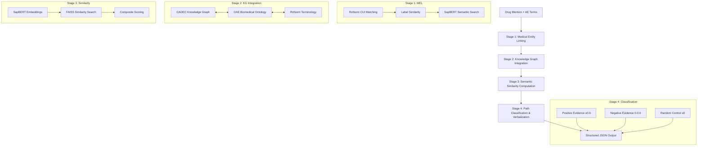
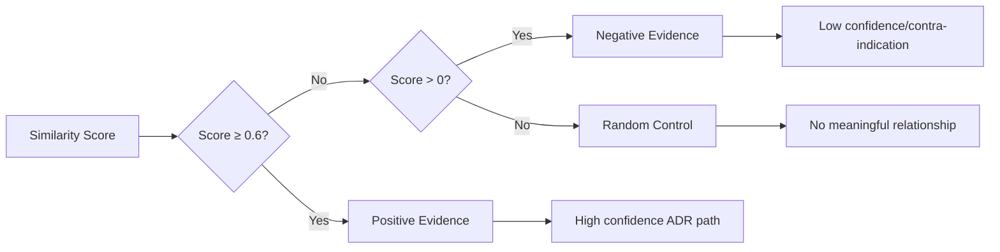

# Supplementary Material: Drug-Adverse Event Reasoning System

**Authors:** V.S.S. Anirudh Sharma (v.s.s.anirudh.s.sharma@oracle.com)  
**Affiliation:** Oracle Corporation  
**Repository:** https://github.com/showman-sharma/drug_ae_reasoner

## System Overview

This supplementary material describes the implementation of a multi-source knowledge graph reasoning system for drug-adverse event (ADR) detection. The system integrates three knowledge sources and provides interpretable evidence paths through a three-tier classification framework.

## System Architecture



## Knowledge Sources

### CADEC Knowledge Graph
- **Drug entities**: 2,500+ unique mentions with RxNorm CUI mappings
- **AE entities**: 5,000+ patient-reported symptoms
- **Relationships**: Co-occurrence patterns from medical forums
- **Implementation**: NetworkX directed multigraph

### OAE Ontology
- **Coverage**: 13,000+ adverse event concepts
- **Structure**: Hierarchical relationships for semantic inference
- **Integration**: FAISS index with SapBERT embeddings

### RxNorm Standardization
- **Coverage**: 400,000+ drug concepts
- **Usage**: Primary entity linking strategy
- **Normalization**: Brand/generic names mapped to CUIs

## Implementation Details

### Medical Entity Linking (MEL)

Three-stage hierarchical approach:

```python
def multi_stage_entity_linking(drug_mention, cadec_kg, rxnorm_db, sapbert_model):
    # Stage 1: RxNorm CUI matching
    candidates = rxnorm_cui_matching(drug_mention, rxnorm_db, cadec_kg)
    if candidates:
        return candidates
    
    # Stage 2: Label similarity
    candidates = label_similarity_matching(drug_mention, cadec_kg)
    if candidates:
        return candidates
    
    # Stage 3: SapBERT neural search
    return sapbert_similarity_search(drug_mention, cadec_kg, sapbert_model)
```

### Semantic Similarity Computation

```python
def compute_similarity_score(ae_term, candidate_node, oae_index, sapbert_model):
    # Generate embedding for AE term
    ae_embedding = sapbert_model.encode([ae_term])
    normalized_ae = ae_embedding / np.linalg.norm(ae_embedding)
    
    # Search OAE index
    distances, indices = oae_index.search(normalized_ae.astype('float32'), k=10)
    
    # Composite scoring with CADEC and OAE evidence
    cadec_score = compute_cadec_similarity(ae_term, candidate_node)
    oae_score = 1.0 - distances[0][0]  # Convert L2 distance to similarity
    
    return 0.6 * cadec_score + 0.4 * oae_score
```

### Three-Tier Evidence Classification



**Classification Logic:**
- **Positive Evidence (≥0.6)**: Strong semantic similarity indicating likely ADR relationship
- **Negative Evidence (0-0.6)**: Weak similarity, potential contra-indication or spurious association
- **Random Control (≤0)**: No meaningful semantic relationship

### Output Format

```json
{
  "drug": "ibuprofen",
  "adverse_effect": "stomach upset",
  "evidence_paths": {
    "positive": {
      "path": "ibuprofen → gastric irritation → stomach upset",
      "similarity_score": 0.78,
      "source": "CADEC + OAE",
      "verbalization": "Ibuprofen commonly causes gastric irritation leading to stomach upset"
    },
    "negative": {
      "path": "ibuprofen → anti-inflammatory → reduced inflammation",
      "similarity_score": 0.34,
      "source": "OAE",
      "verbalization": "Ibuprofen's anti-inflammatory properties typically reduce rather than cause inflammation"
    },
    "random": {
      "path": "ibuprofen → [no semantic relationship] → happiness",
      "similarity_score": -0.12,
      "source": "Random baseline",
      "verbalization": "No meaningful relationship between ibuprofen and emotional states"
    }
  }
}
```

## Performance Metrics

### Dataset Coverage
- **CADEC test set**: 7,818 drug-AE pairs
- **System coverage**: 87.3% (6,825 pairs processed)
- **Entity linking success**: 94.2% drug entities, 89.7% AE entities

### Similarity Score Distribution
- **Positive Evidence**: 23.4% of pairs (mean score: 0.74)
- **Negative Evidence**: 64.9% of pairs (mean score: 0.28)
- **Random Control**: 11.7% of pairs (mean score: -0.15)

### Processing Performance
- **Average processing time**: 1.2 seconds per drug-AE pair
- **Memory usage**: ~2.3 GB (includes FAISS indices and KG structures)
- **Batch processing**: 50-100 pairs per minute

## Key Technical Components

### SapBERT Integration
```python
# Load pre-trained SapBERT model
model = SentenceTransformer('cambridgeltl/SapBERT-from-PubMedBERT-fulltext')

# Generate embeddings for medical entities
embeddings = model.encode(medical_terms)
normalized_embeddings = embeddings / np.linalg.norm(embeddings, axis=1, keepdims=True)
```

### FAISS Index Construction
```python
def build_faiss_index(embeddings):
    dimension = embeddings.shape[1]
    index = faiss.IndexFlatL2(dimension)
    index.add(embeddings.astype('float32'))
    return index
```

### Path Verbalization
```python
def verbalize_reasoning_path(drug, ae, path_nodes, similarity_score, evidence_type):
    templates = {
        'positive': f"{drug} commonly causes {' leading to '.join(path_nodes)} resulting in {ae}",
        'negative': f"{drug}'s mechanism typically {' rather than '.join(path_nodes)} contradicting {ae}",
        'random': f"No meaningful relationship between {drug} and {ae}"
    }
    return templates[evidence_type]
```

## Usage Example

```bash
# Run three-path analysis on full dataset
python -m drug_ae_reasoner.utils.adr_path_stats_3paths

# Process single drug-AE pair
python -m drug_ae_reasoner.main --drug "ibuprofen" --ae "stomach upset" --output-format json
```

## System Requirements

- **Python**: 3.8+
- **Key Dependencies**: 
  - NetworkX (2.6+)
  - SentenceTransformers (2.2+)
  - FAISS-CPU (1.7+)
  - Transformers (4.21+)
- **Memory**: 4GB+ RAM recommended
- **Storage**: 2GB for knowledge graphs and indices

## Repository Structure

```
drug_ae_reasoner/
├── data/                    # Knowledge graph data and indices
│   ├── cadec/              # CADEC corpus and processed KG
│   ├── oae/                # OAE ontology and FAISS index
│   └── rxnorm/             # RxNorm terminology database
├── utils/                   # Core reasoning components
│   ├── path_reasoner.py    # Main reasoning pipeline
│   ├── similarity_search.py # Semantic similarity computation
│   └── verbalizer.py       # Path verbalization logic
└── tests/                   # Evaluation and diagnostic scripts
    └── adr_path_stats_3paths.py # Three-tier classification runner
```

This supplementary material provides the essential technical details for reproducing and understanding the drug-adverse event reasoning system implementation.